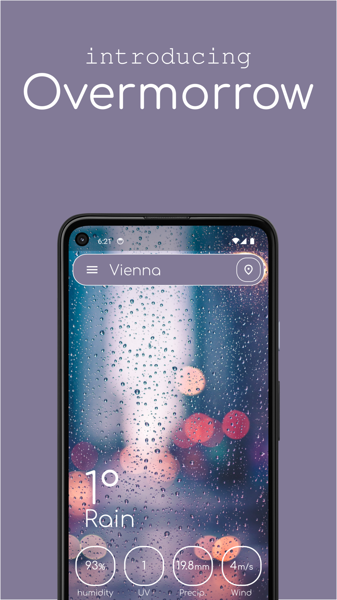
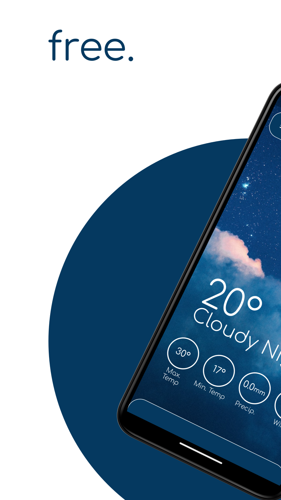
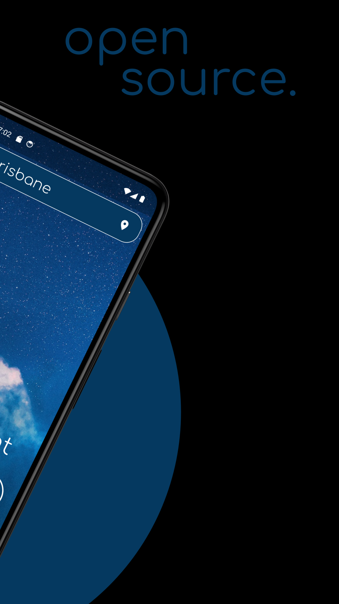
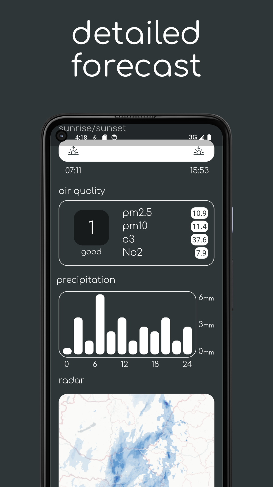
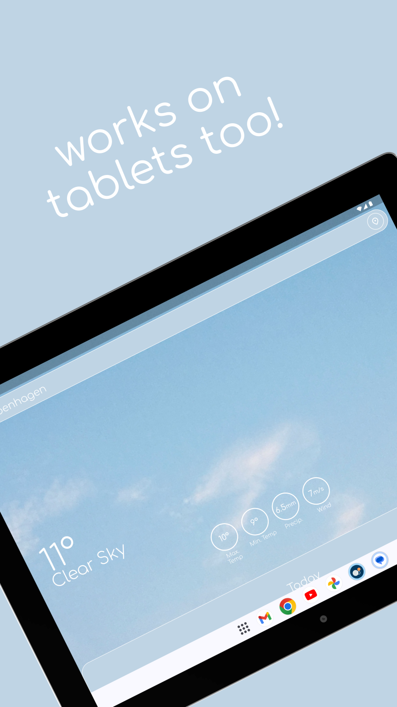
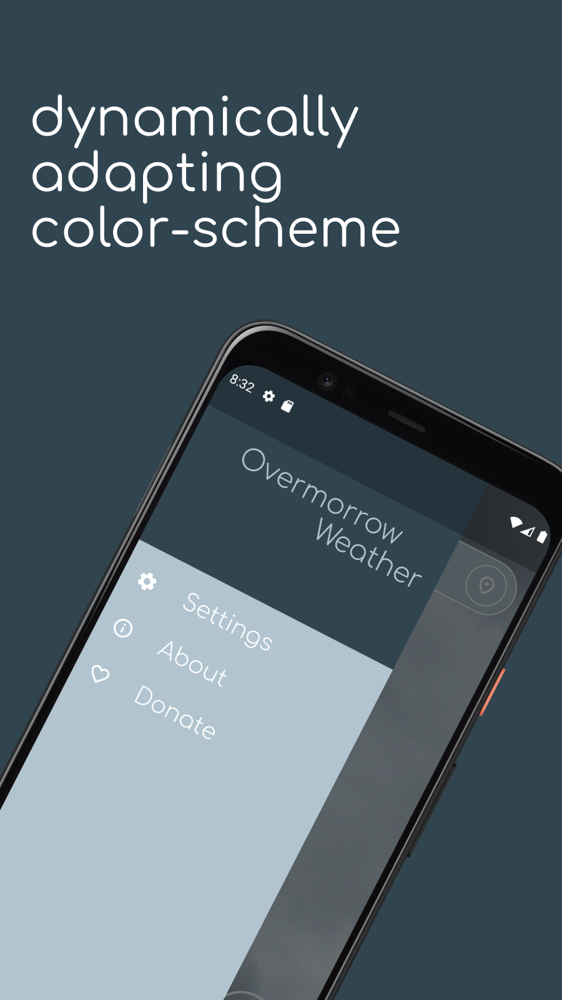
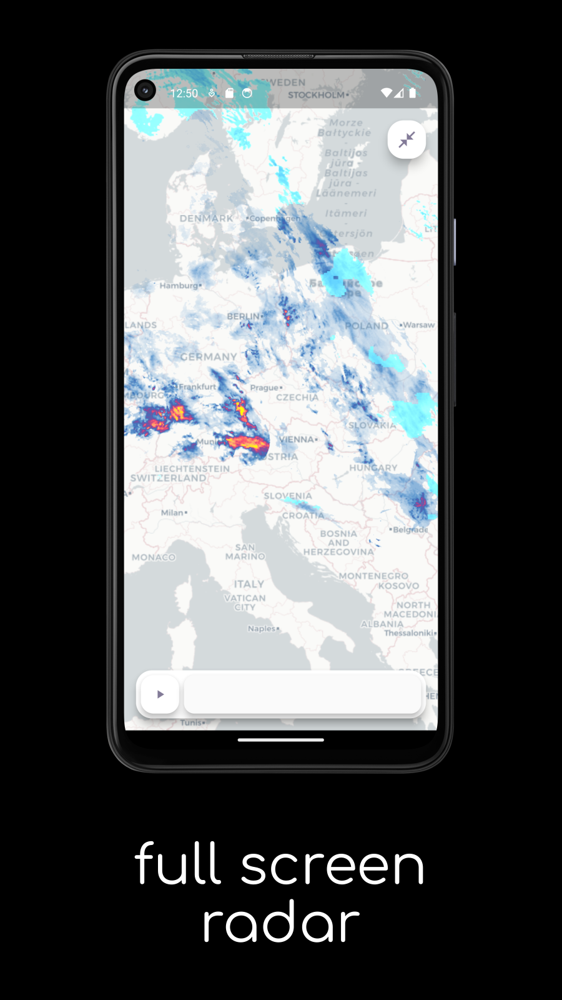
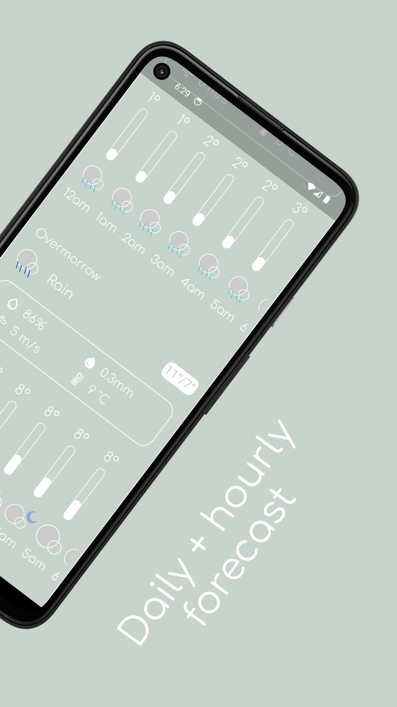

# Overmorrow Weather

https://play.google.com/store/apps/details?id=com.marotidev.Overmorrow

Beautiful minimalist weather app.

## Features

-accurate weather forecast
-open source
-no ads
-no data collected
-minimalist design
-dynamically adapting color scheme
-languages support
-place search
-weather for current location
-unit swapping

