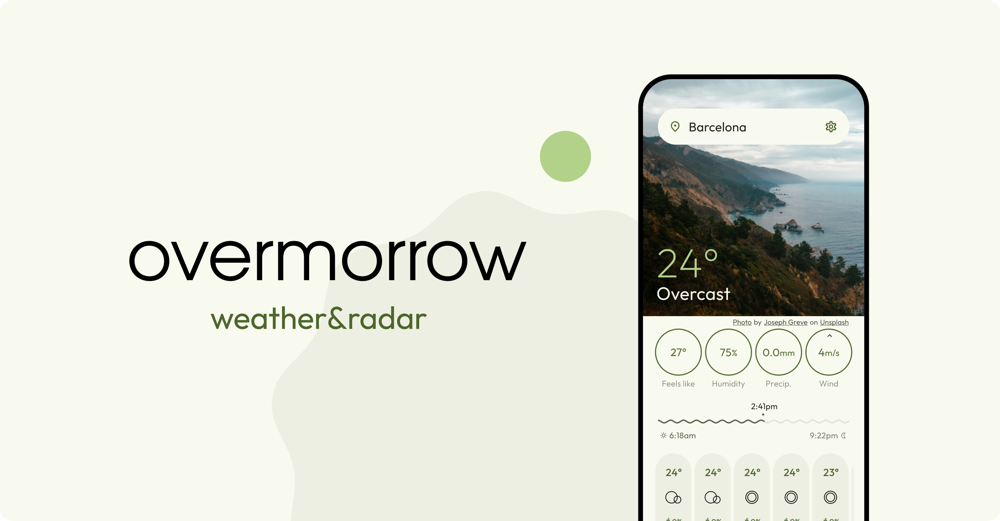
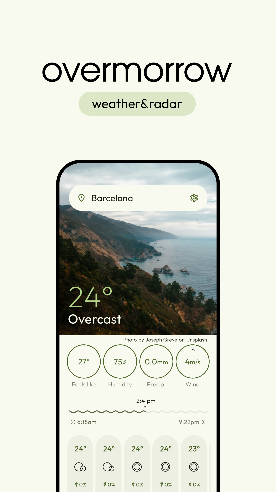
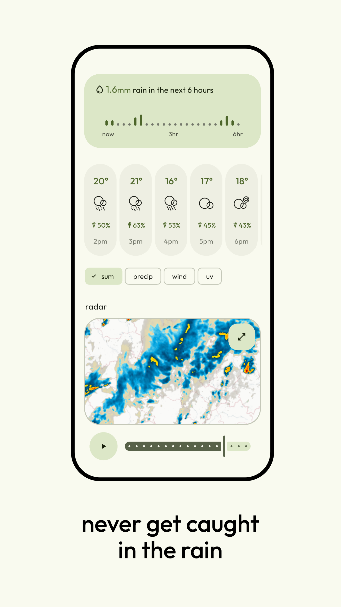
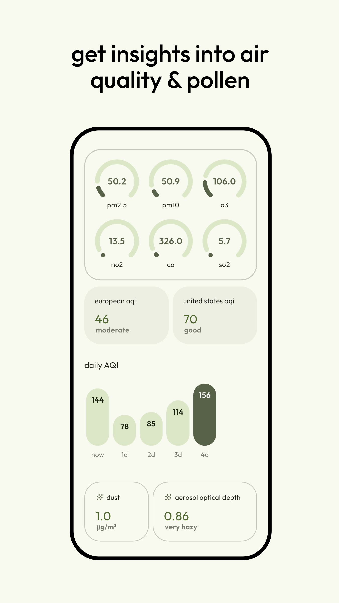
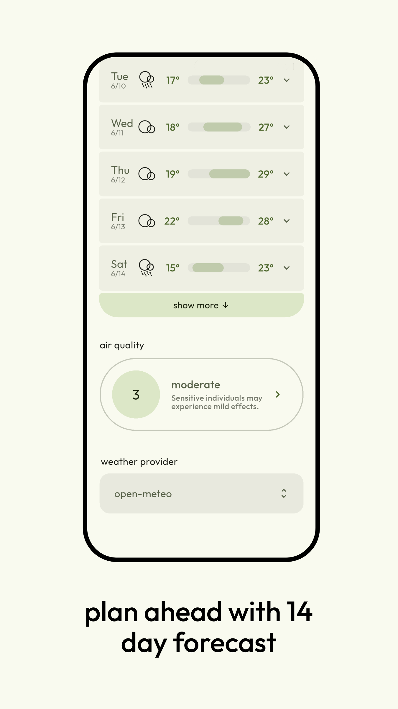
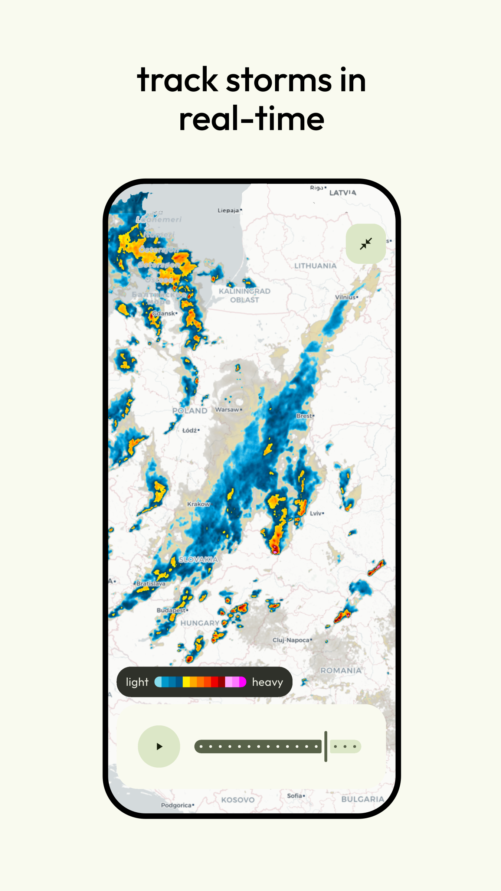
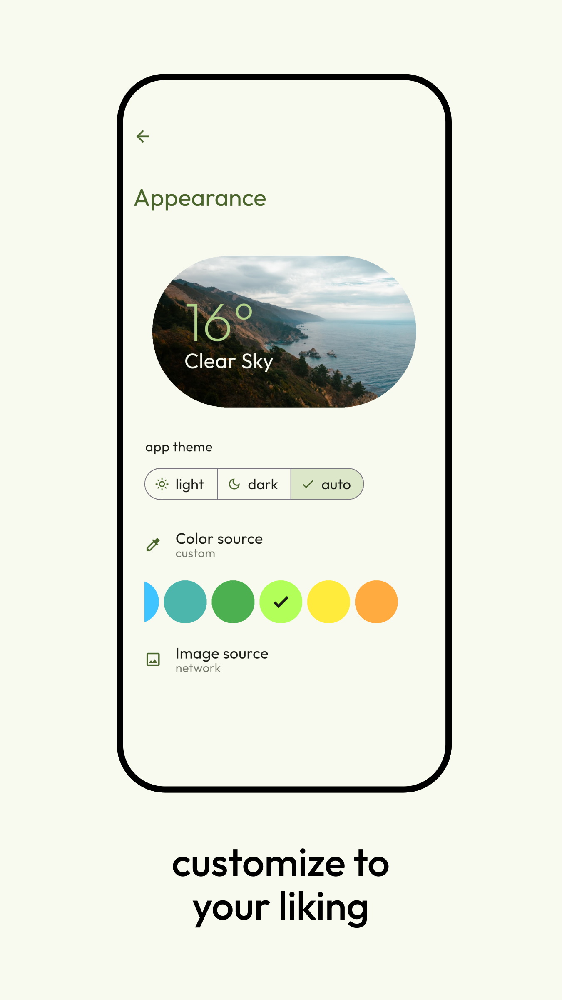
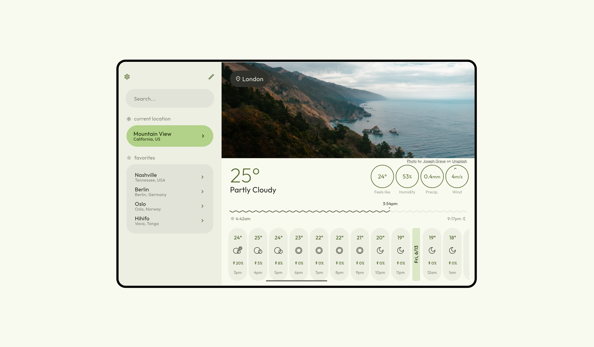
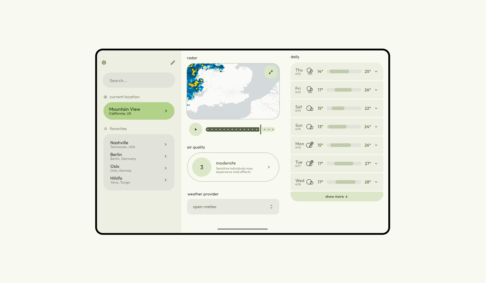

  
 
  
  
  
  
</a>

<h4 align="center">modern material design weather app</h4>

## ⬇️ Download

    

## 🎉 Features
-  **📡 Full screen precipitation radar**  
  *Enjoy a real-time radar, that lets you track storms, rain, and snow*
-  **🗓️ 14 day forecast**  
  *Plan your days ahead easily with 14 days of forecast*
-  **🖼️ Beautiful weather images**  
  *The weather images seamlessly adapt to your current weather condition*
-  **🕒 72 hour forecast**  
  *Track the temperature, precipitation chance, wind-speed, uv and more for the next 72 hours*
-  **🍃 Dedicated Air quality page**  
  *Track pollen, air pollutants, dust, and more, with 5 days of aqi forecast*  
-  **☔ 15 minute rain trend**  
  *See the overview of the precipitation in the next 6 hours in 15 minute intervals*  
-  **🗃️ 3 different weather providers**  
  *Choose the weather source that you find best*
-  **🛜 Offline mode**  
  *See previously loaded data, even when offline*
-  **📢 Weather alerts**  
  *Get notified about upcoming storms, floods, and severe weather alerts*
-  **⏳ Current conditions**  
  *Check the current temperature, feels like, wind speed, humidity and more*  
-  **🌅 Sunrise/sunset times**  
  *Know the time when the sun will rise and set*
-  **⭐ Favorite places**  
  *Save your favorite cities, to always have them just a tap away*   
-  **🔳 Tablet mode**  
  *The app automatically adapts to your device's form factor to always utilize all the screen space*      
-  **✏️ Customization**  
  *Customize app colors, image source, and layout to your liking*   

## 📸 Screenshots

### Phone

  
  
  
  
  
  

### Tablet

  
  

 

## 🌐 Localization
Localizations are hosted on [Weblate](https://hosted.weblate.org/engage/overmorrow-weather/). Translations are welcome!

## 🌤️ Weather providers
- [open-meteo](https://open-meteo.com)
- [weatherapi.com](https://www.weatherapi.com)
- [met-norway](https://api.met.no/)
- [rainvewer](https://www.rainviewer.com/api.html)

## ❓ Why make Overmorrow?
I am 16 and i have been programing since the age of 7. I started small (Scratch and NetsBlox) 
went to Python... and then to Flutter. This is my first ever project that can actually be downloaded by anyone. So I hope you like it!

I have always wanted to make a weather app. At first the concept was just to make an app that 
is free and ad free, but after diving into the whole thing i realized that i wouldn't be the first to do that. 
So instead here is my take on the weather app ui (but i did kep it free and ad free too). I tried to go for a minimalist and organized interface... 

That was a year ago. Since then i have discovered material-You and have redesigned the app twice to try to follow the design guidelines, because I think it looks awesome.

## 🛠️ Built with
- 💙 **Flutter** — Cross-platform UI toolkit for building natively compiled apps for mobile, web, and desktop from a single codebase.
- 🎨 **Material You** — Google's 3rd generation design system, introduced in android 12

## 🎯 Milestones:
  - ✅ Add place searching
  - ✅ Add radar
  - ✅ Add air quality
  - ✅ Add sunrise sunset
  - ✅ Add translations
  - ✅ Add settings page
  - ✅ Add tablet mode
  - ✅ Add more weather providers
  - ✅ Add network images
  - ✅ Implement Material-You 
  - ✅ Add offline mode
  - ✅ Add layout customisation