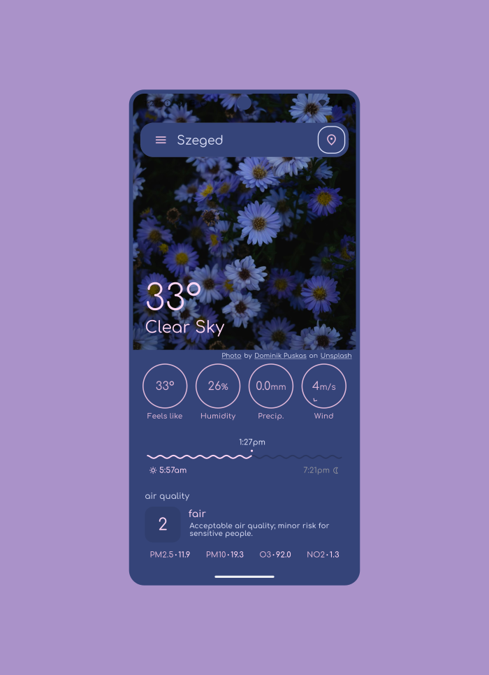
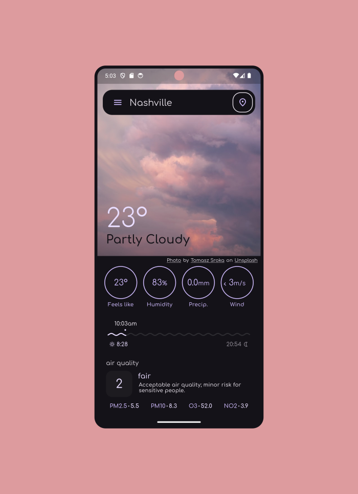
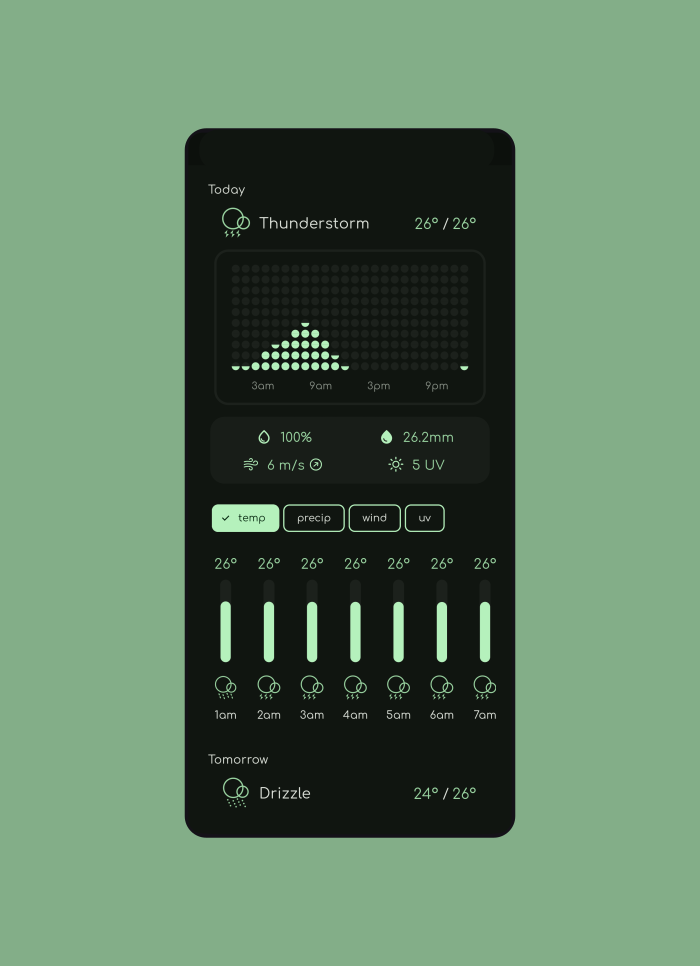
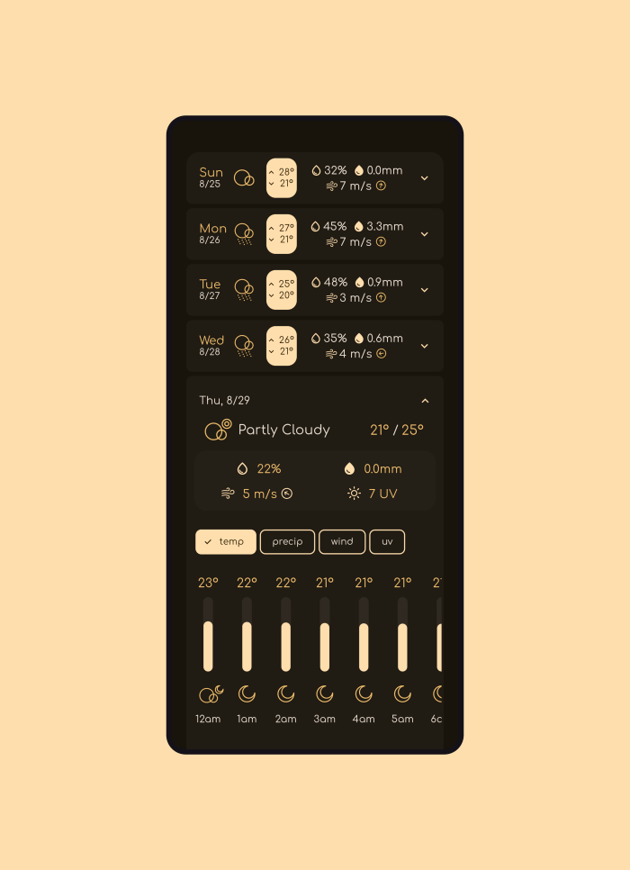
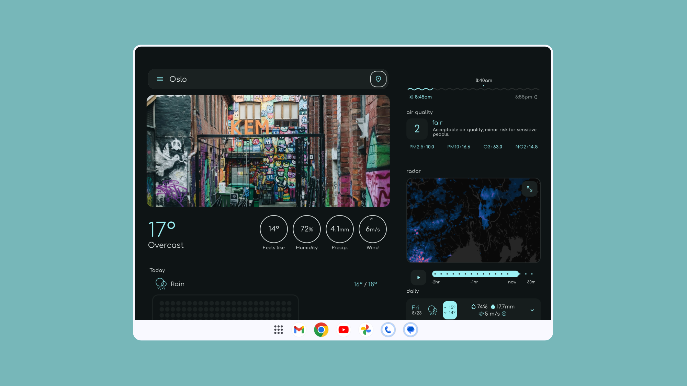
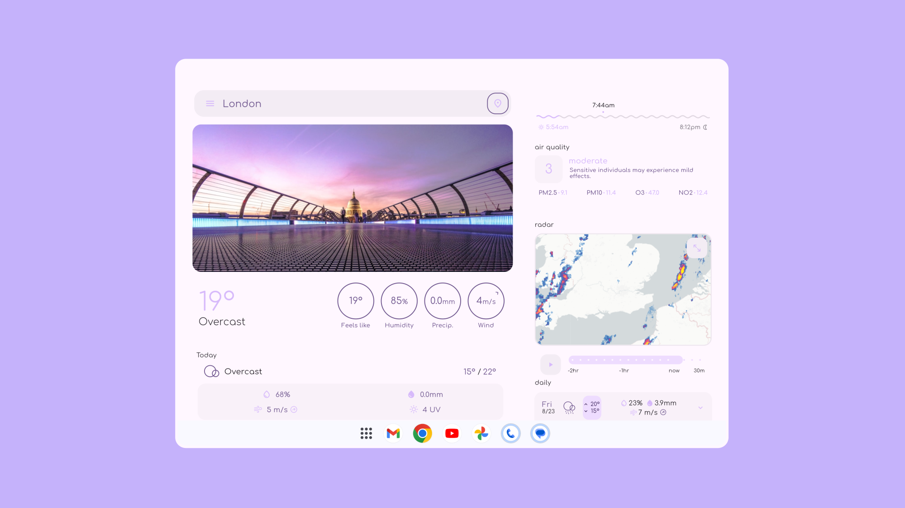

    

 

<h1 style="text-align: center;">Overmorrow</h1>

    
    

<h3 style="text-align: center;">minimalist colorful weather.</h3>

 

    
    
    
    
    

## Weather providers 🌨️
- [open-meteo](https://open-meteo.com)
- [weatherapi.com](https://www.weatherapi.com)
- [met-norway](https://api.met.no/)
- [rainvewer](https://www.rainviewer.com/api.html)

Only now after working on Overmorrow for more than 6 months, have I realized that my 
app is defined as "non commercial" in open-meteo's documentation 😂. Which is great because i can use it completely for free 😎! 
So now i can add 14 days of forecast . Also its one of the most accurate weather providers.

you can also change your provider to met-norway or weatherapi.com.

All the radar images are from rainviewer's radar 💧.

## Features 🎉

- network images that change based on location and weather condition
- accurate weather forecast
- open source
- no ads
- no data collected
- minimalist colorful design
- sunrise / sunset times, current time in city
- rain in the next 6 hours with 15 minute precision
- air quality index, description, summary, pm_2.5, pm10, o3, no2
- compact and fullscreen radar, with 2 hour past, and 30 minutes of future timestamps.
- 3 day detailed forecast, with options for temp, precip, wind and uv
- 14 day compact forecast, with option to open into detailed view.
- rain charts showing the rain on a given day
- option to choose from 3 weather providers
- 5 beautiful color theme options
- 2 search providers

## Tablet mode

## Why make Overmorrow? ❓
I am 15 and i have been programing since the age of 7. I started small (Scratch and NetsBlox) 
went to Python... and then to Flutter. This is my first ever project that can actually be downloaded by anyone. So I hope you like it 😉!

I have always wanted to make a weather app 🌩️. At first the concept was just to make an app that 
is free and ad free, but after diving into the whole thing i realized that i wouldn't be the first to do that. 
So instead here is my take on the weather app ui (but i did kep it free and ad free too 😎). I tried to go for a minimalist and organized interface. 

## Milestones & To-do ✅

- ✅ Add place searching
- ✅ Add radar
- ✅ Add air quality
- ✅ Add sunrise sunset
- ✅ Add translations
- ✅ 14 day forecast 
- ✅ Settings/Info/Donate pages
- ✅ Tablet mode
- ✅ more than one weather provider
- ✅ add network images
- ✅ material you

#### hope to add in the near-future:
 
- ❌ Add widgets (I have been trying but it's just so complicated 😑)
- ❌ Maybe add notifications
- ❌ Maybe add to Iphone (right now Android only)
- ❌ More weather providers

#### Anything I should add? let me know!

## Support me! ❤️

If you want to help, or just simply want to support me.
this is my patreon: https://www.patreon.com/MarotiDevel.
Thank you so much! ❤️

also if you like this app please consider leaving it a star on github ⭐.