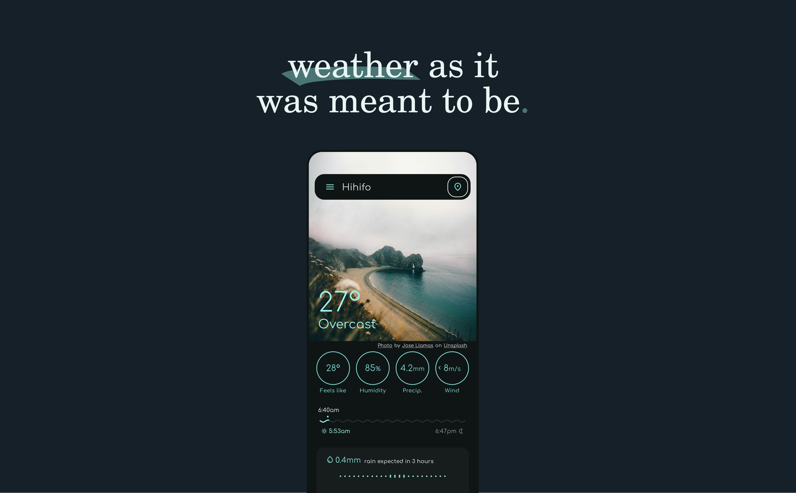
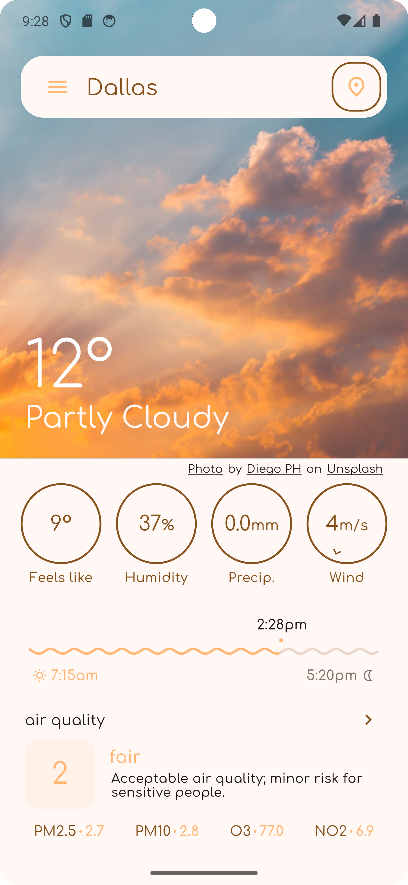
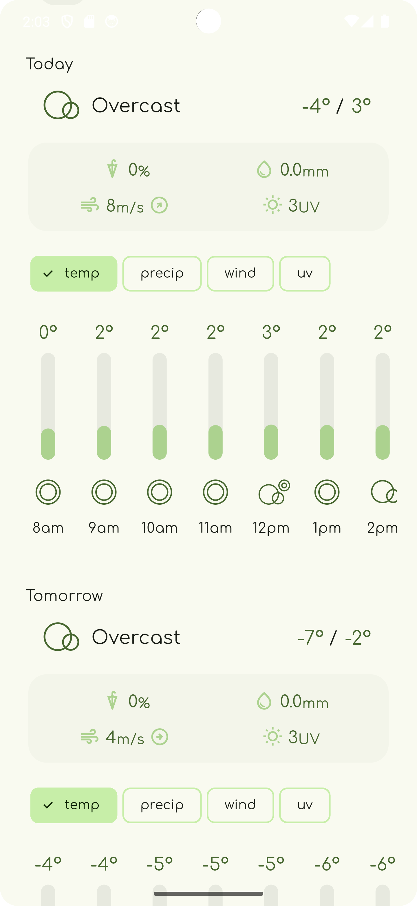
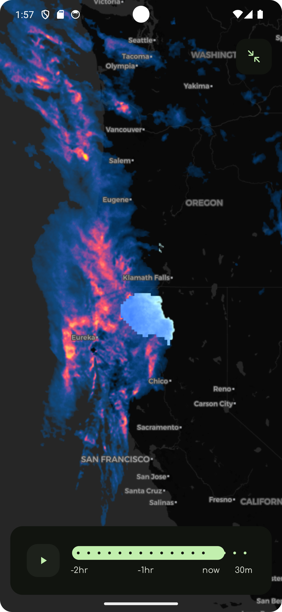
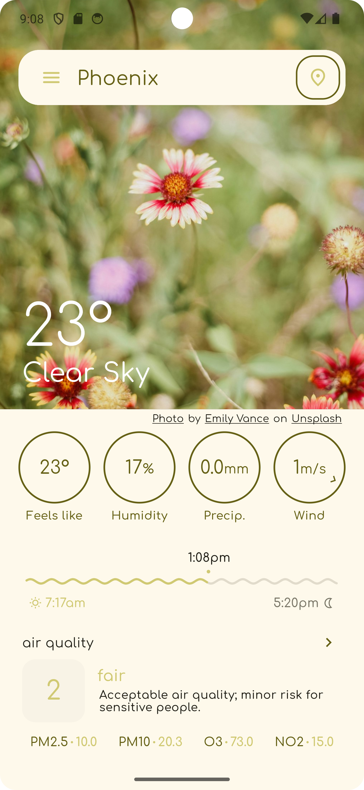
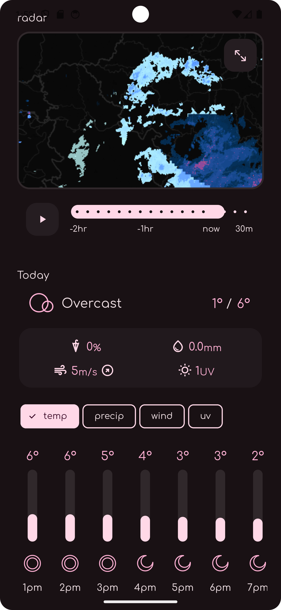
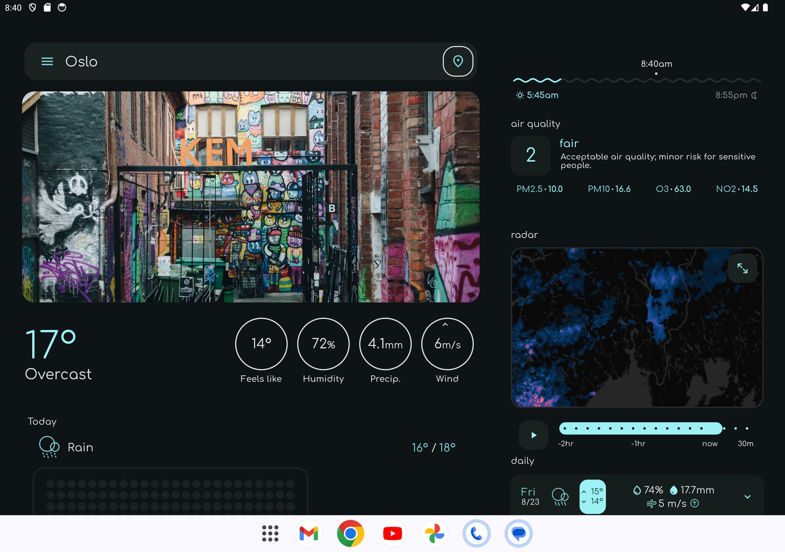

<h1 align="center">Overmorrow</h1>

  
 
  

  
  
</a>

minimalist colorful weather app

## Features
  - weather images from unsplash
  - offline mode
  - no ads
  - current weather
  - sunrise sunset times
  - local time
  - 15 minute precip info
  - air quality
  - small and fullscreen radar
  - 3 days of detailed weather
  - 14 day forecast
  - 3 weather providers
  - material you theme
  - 5 color themes

## Weather providers
- [open-meteo](https://open-meteo.com)
- [weatherapi.com](https://www.weatherapi.com)
- [met-norway](https://api.met.no/)
- [rainvewer](https://www.rainviewer.com/api.html)

## Download

    

## Screenshots

## Tablet mode

## Why make Overmorrow?
I am 15 and i have been programing since the age of 7. I started small (Scratch and NetsBlox) 
went to Python... and then to Flutter. This is my first ever project that can actually be downloaded by anyone. So I hope you like it!

I have always wanted to make a weather app. At first the concept was just to make an app that 
is free and ad free, but after diving into the whole thing i realized that i wouldn't be the first to do that. 
So instead here is my take on the weather app ui (but i did kep it free and ad free too). I tried to go for a minimalist and organized interface. 

## Localization
Localization is hosted on [Weblate](https://hosted.weblate.org/projects/overmorrow-weather/). Translations are welcome!

## Milestones:
  - ✅ Add place searching
  - ✅ Add radar
  - ✅ Add air quality
  - ✅ Add sunrise sunset
  - ✅ Add translations
  - ✅ 14 day forecast 
  - ✅ Settings/Info/Donate pages
  - ✅ Tablet mode
  - ✅ more than one weather provider
  - ✅ add network images
  - ✅ material you

## Support me!

If you want to help, or just simply want to support me.
this is my patreon: https://www.patreon.com/MarotiDevel.
Thank you so much!

also if you like this app please consider leaving it a star on github.