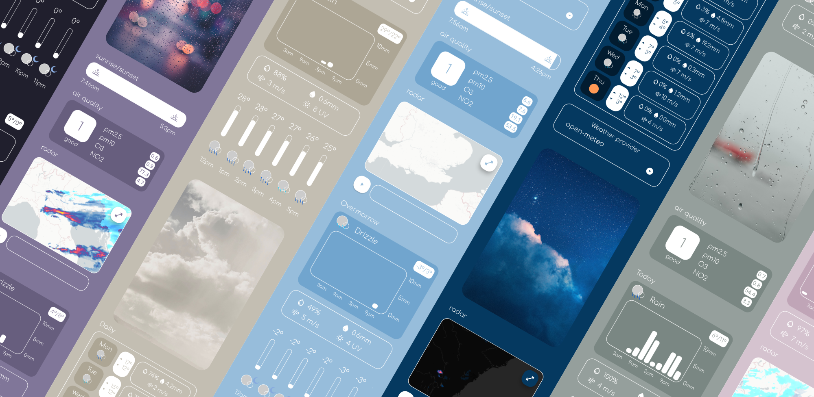
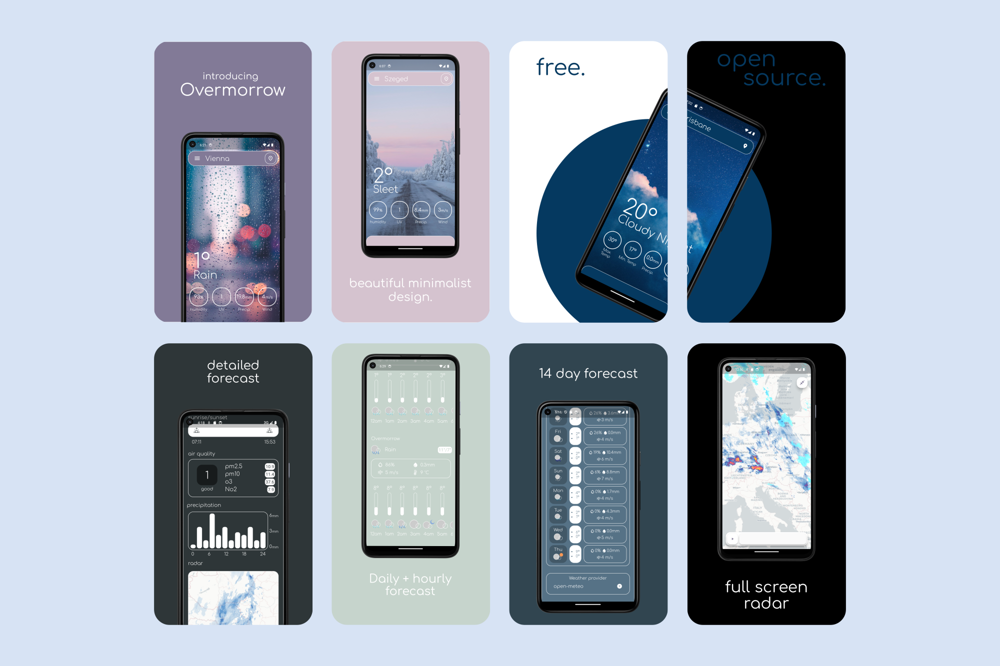

# Overmorrow Weather

### Beautiful minimalist weather app. 

## Weather providers 🌨️
- [open-meteo](https://open-meteo.com)
- [weatherapi.com](https://www.weatherapi.com)
- [rainvewer](https://www.rainviewer.com/api.html)

Only now after working on Overmorrow for more than 6 months, have I realized that my 
app is defined as "non commercial" in open-meteo's documentation 😂. Which is great because i can use it completely for free 😎! 
So now i can add 14 days of forecast . Also its one of the most accurate weather providers.

I get my sunrise sunset times and air quality from weatherapi.com 🍃. 
Also it is offered as a second weather provider, but it only has 3 days of weather data.

And all the radar images are from rainviewer's radar 💧.

## Features 🎉

- accurate weather forecast
- open source
- no ads
- no data collected
- minimalist design
- detailed forecast
- sunrise sunset times
- air quality insights
- full screen radar
- 14 days of forecast
- hourly weather for every day
- dynamically adapting color scheme
- languages support

## Why make Overmorrow? ❓
I am 14 and i have been programing since the age of 7. I started small (Scratch and NetsBlox) 
went to Python... and then to Flutter. This is my first ever project that can actually be downloaded by anyone. So I hope you like it 😉!

I have always wanted to make a weather app 🌩️. At first the concept was just to make an app that 
is free and ad free, but after diving into the whole thing i realized that i wouldn't be the first to do that. 
So instead here is my take on the weather app ui (but i did kep it free and ad free too 😎). I tried to go for a minimalist and organized interface. 

## Milestones & To-do ✅

- ✅ Add place searching
- ✅ Add radar
- ✅ Add air quality
- ✅ Add translations
- ✅ 14 day forecast 
- ✅ Settings/Info/Donate pages

#### hope to add in the near-future:
 
- ❌ Add widgets (I have been trying but it's just so complicated 😑)
- ❌ Add better support for tablets
- ❌ Maybe add notifications
- ❌ Maybe add to Iphone (right now Android only)
- ❌ More weather providers

#### Anything I should add? let me know!

## Support me! ❤️

Overmorrow is a relatively early stage and therefore the user base is relatively low. This way I am able to keep it up with $0 in revenue 💰.
However at larger audience sizes unfortunately i won't be able to do it for free anymore 😥.

So if you want to help, or just simply want to support me.
this is my patreon: https://www.patreon.com/MarotiDevel.
Thank you so much! ❤️

also if you liked this app please consider leaving it a star on github ⭐.